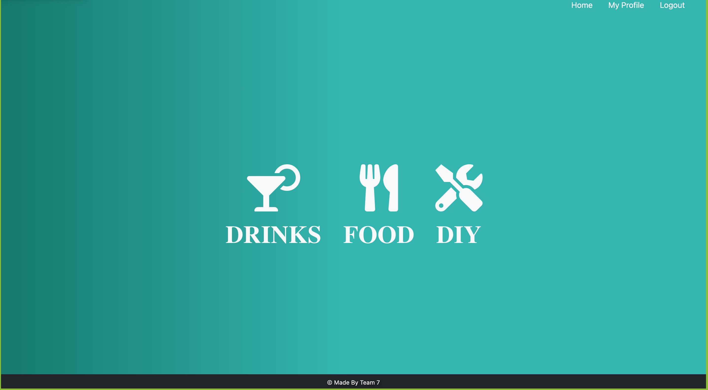
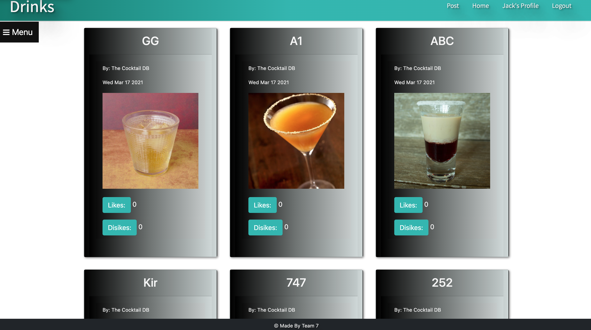
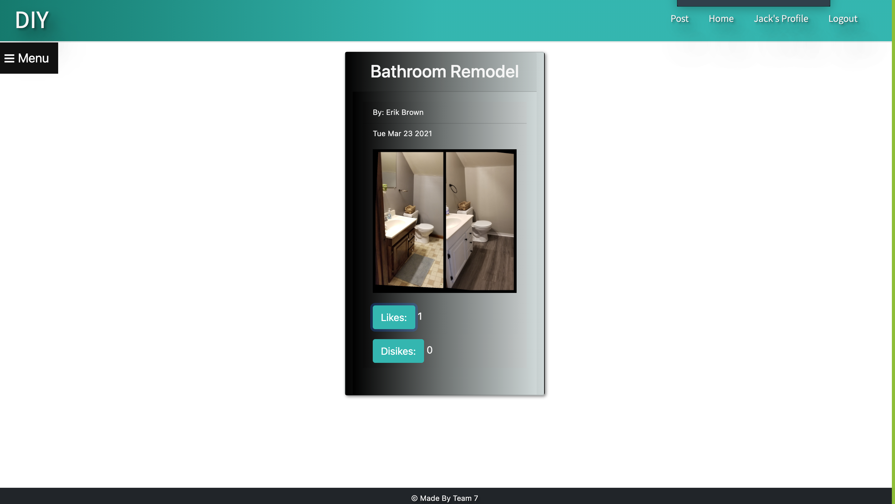

# Post N' Stuff
by: Erik Brown, Jenny Smith, Alex Strickland, and Jack Funck

## table of Contents:
 - [Link.](#link)
 - [Description. ](#desc)
 - [Instructions. ](#instr)
 - [Technologies.](#tc)
 - [Api's.](#api)
 - [Dependencies](#dep)
 - [Video. ](#video)
 - [Screen-Shots.](#sc)

## Link
<<<<<<< HEAD
give it a try: <a href="https://postnstuff.herokuapp.com/" target="_blank">Post N' Stuff</a>
=======
give it a try: <a href="https://postnstuff.herokuapp.com/ target="_blank">Post N' Stuff</a>
>>>>>>> 611f400a6e3508372b94c7daa069efb066e87d67

## Description

This is a aplication that allows you create, like, and dislike posts from drinks, food, and diy projects.

## Instructions
* If you dont already have a profile hit register  and type in your First Name, Last Name, Email , and Password and then hit Submit.
* Once you have established a profile hit Login
* You will see Drink's, Food, and DIY on the home screen, Click on one of your intrest and you will be navigated to the desired page.
* Click post at the top right corner plug in title, Image link, Choose category, then Type in content and hit Post.
* go to the page of your post category and you post will appear.
* You also will be able to like and dislike the posts.

## Technologies Used
* Node.js
* JavaScript
* bootstrap

## Dependencies
* express
* express-handlebars
* es-lint
* mysql2
* sequelize

## Apis used:
<a href="https://www.themealdb.com/api.php" target="_blank">TheMealDB</a>
<a href="https://www.thecocktaildb.com/api.php" target= "_blank">TheCockailDB</a>

# Video of how it works.
> If you click GIF you will be navigated to YouTube for a full-video.

# Screen Shots
### Home

### Drinks

### Food

### Diy

